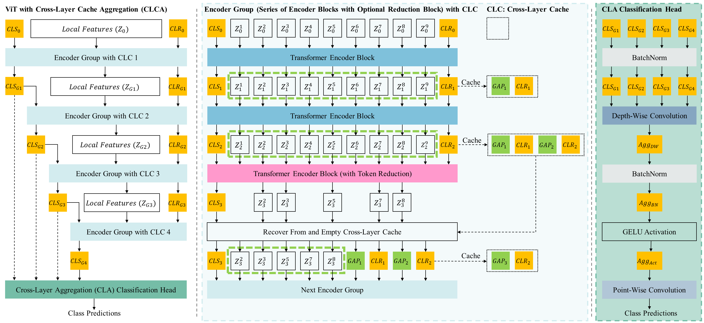
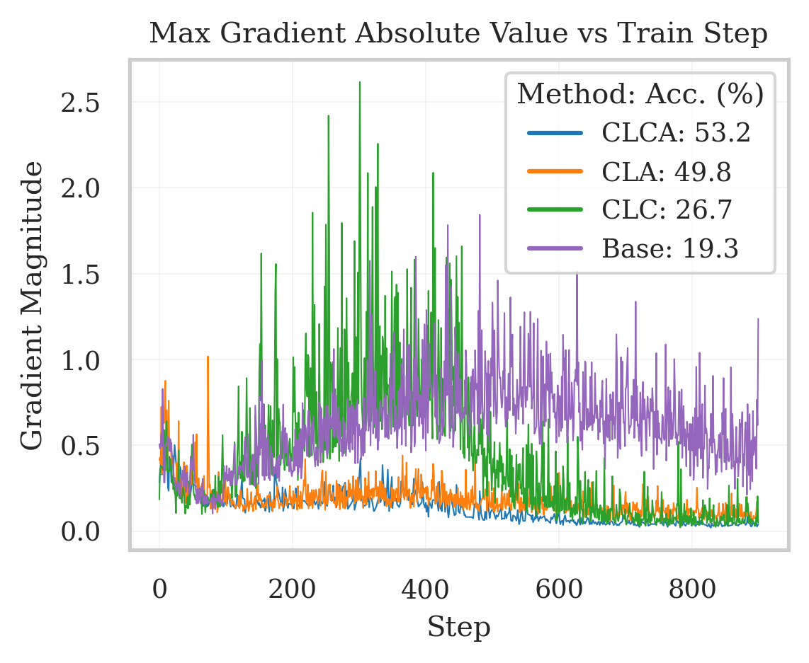
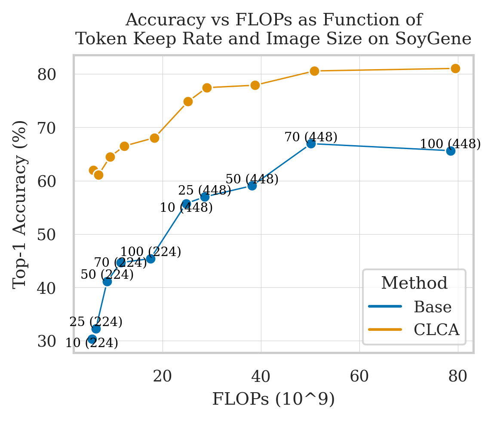
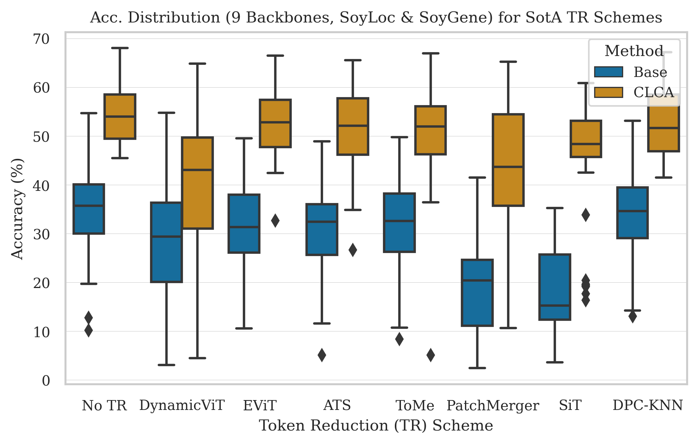
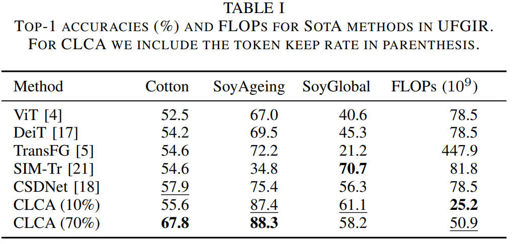

# Cross-Layer Cache Aggregation for Token Reduction in Ultra-Fine-Grained Image Recognition

This repository is the official Pytorch implementation of
[Cross-Layer Cache Aggregation for Token Reduction in Ultra-Fine-Grained Image Recognition](https://arxiv.org/abs/2501.00243)
accepted for publication at ICASSP 25. 


We propose a novel plug-in-method, CLCA, to avoid information loss and instabilities
during training brought by token reduction methods for ViTs in
ultra-fine-grained image recognition (UFGIR) datasets. CLCA incorporates a 
Cross-Layer Aggregation (CLA) classification head and Cross-Layer Cache (CLC)
mechanisms to aggregate and transfer information across layers of a ViT:



As it can be observed, CLCA effectively reduces the instabilities
as observed by the large fluctuation in gradients during training:



Our method achieves a superior accuracy vs cost (in terms of FLOPs)
trade-off compared to alternatives.



Furthermore, it consistently boosts the performance of token reduction methods
across a wide a variety of settings (different backbones, keep rates, datasets):



When compared to SotA UFGIR methods our method obtains favorable results across multiple
datasets at a lower cost:



Pre-trained checkpoints are available on 
[HuggingFace](https://huggingface.co/NYCU-PCSxNTHU-MIS/CLCACrossLayerCacheAggregationTokenReductionUFGIR)!


## Requirements

Requirements can be found in the requirements.txt file. 

## Datasets

We use the UFGIR leaves datasets from:
```
Xiaohan Yu, Yang Zhao, Yongsheng Gao, Xiaohui Yuan, Shengwu Xiong (2021). Benchmark Platform for Ultra-Fine-Grained Visual Categorization BeyondHuman Performance. In ICCV2021.
https://github.com/XiaohanYu-GU/Ultra-FGVC?tab=readme-ov-file
```

## Training

To finetune a `ViT B-16` model pretrained with `CLIP` style pretraining (on `Laion2b`dataset) on SoyGene dataset with `EViT` token reduction, keep rate 0.1, and reduction at layers 4, 7, and 10 with the proposed `CLCA`:


```
python train.py --num_workers 24 --reduction_loc 3 6 9 --serial 30 --input-size 448 --ifa_head --clc --num_clr 1 --train_trainval --seed 1 --cfg configs/soygene_ft_weakaugs.yaml --model evit_vit_base_patch16_clip_224.laion2b --lr 0.0001 --keep_rate 0.1
```

## Acknowledgements and Code Credits

We thank NYCU's HPC Center and National Center for High-performance Computing (NCHC) for providing computational and storage resources. 

We also thank [Weight and Biases](https://wandb.ai/) for their platform for experiment management.

This repository is based on [Which Tokens to Use? Investigating Token Reduction in Vision Transformers](https://github.com/JoakimHaurum/TokenReduction).

Specifically, we extended most token reduction methods to support the proposed CLCA and a wider variety of
backbones asides from DeiT, as implemented in the [timm](https://github.com/huggingface/pytorch-image-models) library.

Also, added support for a wider variety of (U)FGIR datasets, parameter-efficient fine-tuning,
and support for [H2T](https://arxiv.org/abs/2201.03529) and [VQT](https://arxiv.org/abs/2212.03220).

Code for H2T and VQT are based on the official implementations:
- [H2T](https://github.com/google-research/head2toe)
- [VQT](https://github.com/andytu28/VQT)

Original implementation is based on the following:

The token reduction method code is based and inspired by:
- The DPC-KNN method is based on the official code repository: [https://github.com/zengwang430521/TCFormer](https://github.com/zengwang430521/TCFormer)
- The DynamicViT method is based on the official code repository: [https://github.com/raoyongming/DynamicViT](https://github.com/raoyongming/DynamicViT)
- The EViT and Top-K methods are based on the official EViT code repository: [https://github.com/youweiliang/evit](https://github.com/youweiliang/evit)
- The Sinkhorn method is based on the official code repository: [https://github.com/JoakimHaurum/MSHViT](https://github.com/JoakimHaurum/MSHViT)
- The SiT method is based on the official code repository: [https://github.com/Sense-X/SiT](https://github.com/Sense-X/SiT)
- The ToMe method is based on the official code repository: [https://github.com/facebookresearch/ToMe](https://github.com/facebookresearch/ToMe)
- The ATS and PatchMerger methods are based on the implementation from Phil Wang (Lucidrains): [https://github.com/lucidrains/vit-pytorch](https://github.com/lucidrains/vit-pytorch)

Parts of the training code and large part of the ViT implementation is based and inspired by:
- The timm framework by Ross Wrightman / HuggingFace: [https://github.com/huggingface/pytorch-image-models](https://github.com/huggingface/pytorch-image-models)
- The DeiT training and evaluation code: [https://github.com/facebookresearch/deit](https://github.com/facebookresearch/deit)
- The EViT training and evaluation code: [https://github.com/youweiliang/evit](https://github.com/youweiliang/evit)
- The multi-label training and evaluation code from the Assymetric Loss paper: [https://github.com/Alibaba-MIIL/ASL](https://github.com/Alibaba-MIIL/ASL)

Parts of the analysis code is based and inspiredby:
- The model feature similarity metrics are based on the official code repository of the "Grounding Representation Similarity with Statistical Testing" paper: [https://github.com/js-d/sim_metric](https://github.com/js-d/sim_metric)
- The metrics used for comparing global pruning-based reduction pattern are ported from the official MATLAB code repository of the "What do different evaluation metrics tell us about saliency models?" paper: [https://github.com/cvzoya/saliency/tree/master/code_forMetrics](https://github.com/cvzoya/saliency/tree/master/code_forMetrics)

## License

The Code is licensed under an MIT License, with exceptions of the afforementioned code credits which follows the license of the original authors.

## Bibtex
```
@misc{rios_cross-layer_2024,
    title = {Cross-{Layer} {Cache} {Aggregation} for {Token} {Reduction} in {Ultra}-{Fine}-{Grained} {Image} {Recognition}},
    copyright = {All rights reserved},
    doi = {10.48550/arXiv.2501.00243},
    url = {http://arxiv.org/abs/2501.00243},
    publisher = {arXiv},
    author = {Rios, Edwin Arkel and Yuanda, Jansen Christopher and Ghanz, Vincent Leon and Yu, Cheng-Wei and Lai, Bo-Cheng and Hu, Min-Chun},
    month = dec,
    year = {2024},
    annote = {Comment: Accepted to ICASSP 2025. Main: 5 pages, 4 figures, 1 table},
}
```
